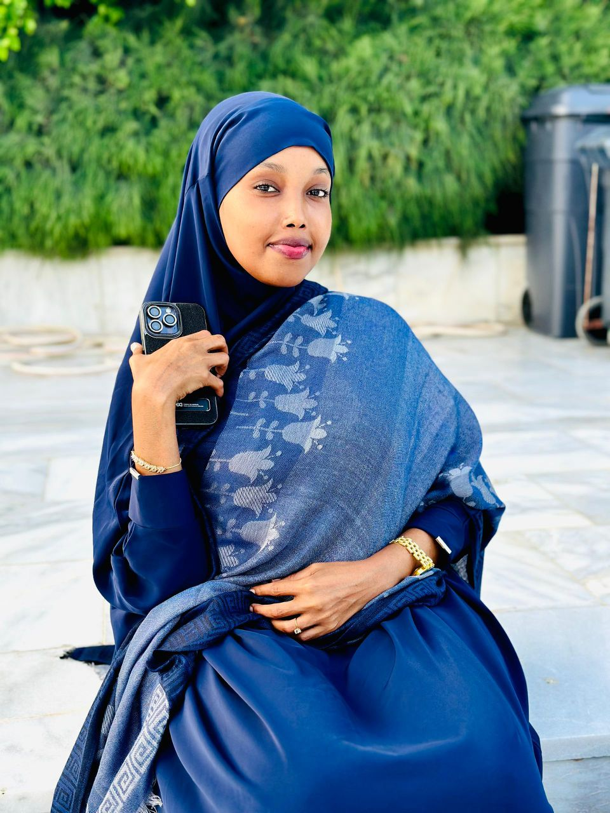

<div align="center">
  
</div>

<br/>

[](https://linkedin.com)
[](https://github.com/RuweydaAbdulKhadirAdam)


</div>

---

## `> whoami`

```yaml
name        : Ruweyda Abdul Khadir Adam
role        : Software Engineering Student (Final Year)
university  : Jamhuuriya University of Science & Technology
location    : Mogadishu, Somalia 🇸🇴
focus       : Full-Stack Web · Mobile · System Design
status      : Open to opportunities & collaboration
motto       : Clean code. Real impact. Built in Somalia.
```

✨ I turn ideas into **products**. Whether it's a scalable web backend,
a polished mobile interface, or a complex system architecture —
I build with **intention**, **clarity**, and care for the **user experience**.

---


## 👩‍💻 About Me

I am a passionate software developer who enjoys building modern applications, solving problems, and continuously learning new technologies.

- 🌱 Currently learning modern development technologies
- 💻 Interested in Web Development
- 📱 Interested in Mobile Development
- 🗄️ Passionate about Databases
- 🚀 Always exploring new tools and frameworks
- 🤝 Open to collaboration and learning opportunities

---


---

## 🎯 Development Roadmap

Halkan waa meelaha aan diirada saarayo si aan u horumariyo xirfadeyda software engineering:

| **Frontend & Mobile** | **Backend & Architecture** | **Growth & Contribution** |
| :--- | :--- | :--- |
| ⚛️ Improve React | 🚀 Master Express.js | 🛠️ Build Real World Projects |
| 💙 Master Flutter | 🗄️ Database Design | 🌐 Contribute to Open Source |
| | ⚡ Frappe Framework | |

---
### 📈 Status Overview
*   **Current Priority:** Improving React & Frappe Framework.
*   **Building:** Scaling Guri-Maal & School Management System.
*   **Goal:** Moving from "Learning" to "Mastery" in System Architecture.


---


## 🚀 Featured Project

<div align="center">

### 🏫 School Management System

*Web-based platform streamlining institutional administration*

| | |
|---|---|
| **Problem** | Manual school admin processes are slow, error-prone, and hard to scale |
| **Solution** | Automated workflows, centralized records, clean data architecture |
| **Stack** | PHP · MySQL |

[](https://github.com)

</div>

---

## 🛠️ Tech Stack

<div align="center">

### Frontend


### Backend & Mobile


### Databases & Tools


<br/>


</div>

---

## 📊 GitHub Analytics

<div align="center">


</div>

---

## 📈 Contribution Activity

<p align="center">
  
</p>


## 🔭 Currently

```json
{
  "status": "Final Year – Software Engineering",
  "learning": ["Frappe Framework", "System Design", "Cloud Architecture"],
  "building": ["Scalable web applications", "Clean mobile UX"],
  "open_to": ["Collaboration", "Open Source", "New Opportunities"]
}
```

---

<div align="center">

<svg width="900" height="80" viewBox="0 0 900 80" xmlns="http://www.w3.org/2000/svg">
  <defs>
    <linearGradient id="bgF" x1="0" y1="0" x2="1" y2="1">
      <stop offset="0%" stop-color="#0d0d1a"/>
      <stop offset="100%" stop-color="#130a28"/>
    </linearGradient>
    <linearGradient id="lineF" x1="0" y1="0" x2="1" y2="0">
      <stop offset="0%" stop-color="#00f5d4" stop-opacity="0"/>
      <stop offset="30%" stop-color="#00f5d4" stop-opacity="0.7"/>
      <stop offset="70%" stop-color="#ff2d78" stop-opacity="0.7"/>
      <stop offset="100%" stop-color="#ff2d78" stop-opacity="0"/>
    </linearGradient>
  </defs>
  <rect width="900" height="80" fill="url(#bgF)"/>
  <path fill="#00f5d4" fill-opacity="0.05"><animate attributeName="d" dur="5s" repeatCount="indefinite" values="M0,0 Q450,20 900,0 L900,6 Q450,26 0,6 Z;M0,0 Q450,6 900,0 L900,6 Q450,12 0,6 Z;M0,0 Q450,20 900,0 L900,6 Q450,26 0,6 Z"/></path>
  <line x1="120" y1="28" x2="780" y2="28" stroke="url(#lineF)" stroke-width="0.8"/>
  <text x="450" y="56" text-anchor="middle" font-family="Georgia, serif" font-size="15" fill="#00f5d4" font-style="italic">✨  Clean code. Real impact. Built in Somalia. 🇸🇴  ✨</text>
  <circle cx="80" cy="50" r="1.2" fill="#a855f7"><animate attributeName="opacity" values="1;0.2;1" dur="2.5s" repeatCount="indefinite"/></circle>
  <circle cx="820" cy="50" r="1.2" fill="#ff2d78"><animate attributeName="opacity" values="0.8;0.1;0.8" dur="3s" repeatCount="indefinite"/></circle>
</svg>

</div>
