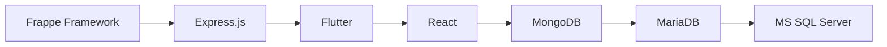

██████╗ ██╗   ██╗██╗    ██╗███████╗██╗   ██╗██████╗
██╔══██╗██║   ██║██║    ██║██╔════╝╚██╗ ██╔╝██╔══██╗
██████╔╝██║   ██║██║ █╗ ██║█████╗   ╚████╔╝ ██║  ██║
██╔══██╗██║   ██║██║███╗██║██╔══╝    ╚██╔╝  ██║  ██║
██║  ██║╚██████╔╝╚███╔███╔╝███████╗   ██║   ██████╔╝
╚═╝  ╚═╝ ╚═════╝  ╚══╝╚══╝ ╚══════╝   ╚═╝   ╚═════╝

                 R U W E Y D A

<h3 align="center">
Software Developer • Web & Mobile Developer • Technology Enthusiast
</h3>


<p align="center">
  
</p>

---

## 👩‍💻 About Me

I am a passionate software developer who enjoys building modern applications, solving problems, and continuously learning new technologies.

- 🌱 Currently learning modern development technologies
- 💻 Interested in Web Development
- 📱 Interested in Mobile Development
- 🗄️ Passionate about Databases
- 🚀 Always exploring new tools and frameworks
- 🤝 Open to collaboration and learning opportunities

---

## 🚀 Technologies & Frameworks

<p align="center">


</p>

### Development Stack

```txt
Frameworks
├── Frappe Framework
├── Express.js
├── Flutter
└── React

Styling
└── Tailwind CSS

Databases
├── MongoDB
├── MariaDB
└── MS SQL Server
```

---

## 🛠️ Tools I Use

<p align="center">


</p>

```txt
Tools
├── GitHub
├── VS Code
├── XAMPP
├── pgAdmin
├── Postman
├── Docker
└── Jupyter Notebook
```

---

## 📊 GitHub Statistics

<p align="center">
  
</p>

<p align="center">
  
</p>

---

## 🔥 GitHub Streak

<p align="center">
  
</p>

---

## 📈 Contribution Activity

<p align="center">
  
</p>

---

## 🎯 Current Goals

```txt
✓ Improve React Skills
✓ Master Flutter Development
✓ Learn Advanced Express.js
✓ Build Real World Projects
✓ Improve Database Design Skills
✓ Learn More About Frappe Framework
✓ Contribute To Open Source Projects
```

---

## 📚 Learning Path



---

## 🌟 Featured Skills

<table align="center">
<tr>
<td align="center">⚛️ React</td>
<td align="center">📱 Flutter</td>
<td align="center">🎨 Tailwind CSS</td>
</tr>

<tr>
<td align="center">⚡ Express.js</td>
<td align="center">🗄️ MongoDB</td>
<td align="center">💾 MS SQL</td>
</tr>

<tr>
<td align="center">🔧 Docker</td>
<td align="center">🐙 GitHub</td>
<td align="center">💻 VS Code</td>
</tr>
</table>

---

## 🌐 Connect With Me

<p align="center">
  <a href="https://github.com/RuweydaAbdulKhadirAdam">
    
  </a>
</p>

---

<div align="center">

### 💡 "Every expert was once a beginner."

⭐ Thanks for visiting my profile!

</div>
