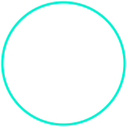

<div align="center">

<!-- ANIMATED SVG HEADER - NO EXTERNAL SERVICE NEEDED -->


<br/>

[](https://linkedin.com)
[](https://github.com)


</div>

---

## `> whoami`



```yaml
name        : Ruweyda Abdul Khadir Adam
role        : Software Engineering Student (Final Year)
university  : Jamhuuriya University of Science & Technology
location    : Mogadishu, Somalia 🇸🇴
focus       : Full-Stack Web · Mobile · System Design
status      : Open to opportunities & collaboration
motto       : Clean code. Real impact. Built in Somalia.
```

✨ I turn ideas into **products**. Whether it's a scalable web backend,
a polished mobile interface, or a complex system architecture —
I build with **intention**, **clarity**, and care for the **user experience**.

---

## 🚀 Featured Project

<div align="center">

### 🏫 School Management System

*Web-based platform streamlining institutional administration*

| | |
|---|---|
| **Problem** | Manual school admin processes are slow, error-prone, and hard to scale |
| **Solution** | Automated workflows, centralized records, clean data architecture |
| **Stack** | PHP · MySQL |

[](https://github.com)

</div>

---

## 🛠️ Tech Stack

<div align="center">

### Frontend


### Backend & Mobile


### Databases & Tools


<br/>


</div>

---

## 📊 GitHub Analytics

<div align="center">


</div>

---

## 🔭 Currently

```json
{
  "status": "Final Year – Software Engineering",
  "learning": ["Frappe Framework", "System Design", "Cloud Architecture"],
  "building": ["Scalable web applications", "Clean mobile UX"],
  "open_to": ["Collaboration", "Open Source", "New Opportunities"]
}
```

---

<div align="center">

<!-- ANIMATED SVG FOOTER -->


</div>
